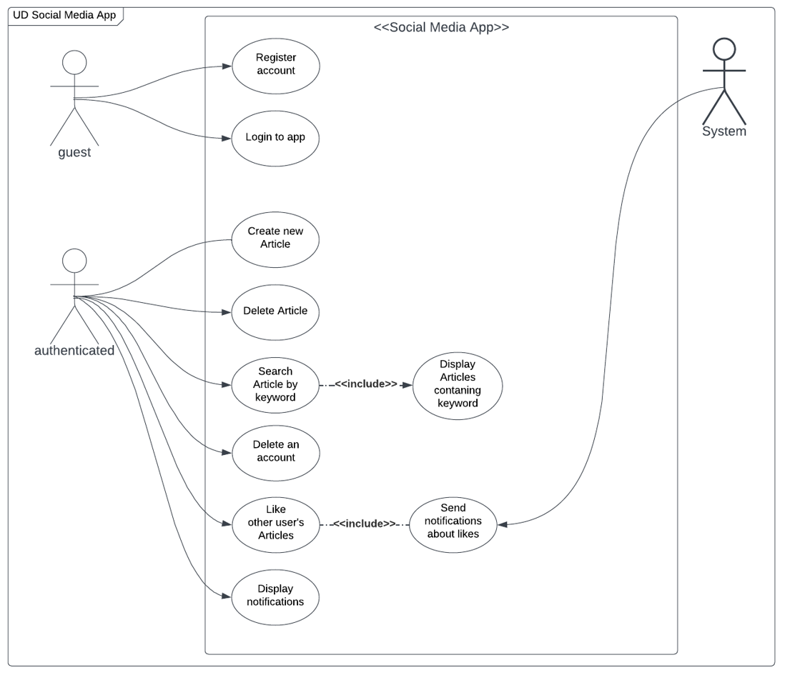
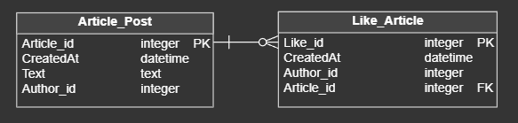
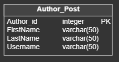
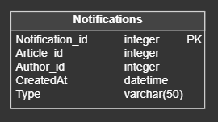

# Articles App

> This full-stack social media application allows users to create accounts, connect with friends, post updates, and
> comment on each other's posts. The application includes user authentication and authorization, as well as a database
> to
> store user and post data. It also allows users to search for other users or posts, and provides notifications for new
> posts or comments. Overall, this social media application provides a platform for users to interact and share their
> thoughts with others in a simple and intuitive way.

## Table of Contents

* [General Info](#general-information)
* [Technologies Used](#technologies-used)
* [Run and Test](#run-and-test)
* [Use case diagram](#use-case-diagram)
* [Microservices](#microservices)
* [Project Status](#project-status)
* [Room for Improvement](#room-for-improvement)
* [Contact](#contact)

## General Information

- Front-end of the application has been written in vanilla JavaScript in architecture based on Web Components.


- The backend of the application was written based on microservice architecture. Every service written in Java was
  reformatted to Kotlin language. Spring Boot framework was used to create the project. The database is temporarily
  based on an embedded H2 database.


- All microservices run in a Docker container.


- The purpose of writing this project is to improve my programming skills, learn various tools and demonstrate my
  ability to write readable and working code.


- Initially, the application was a simple REST API written in Java for the recruitment process. It went through a
  transformation caused by my desire to learn the Kotlin language, microservices architecture and build a more complex
  frontend. The current version is a complete full-stack application, which I will continue to use to learn new tools
  and correct programming practices.

## Technologies Used

- Kotlin
- JavaScript
- Spring Boot
- Spring Cloud
- Hibernate, JPA
- Apache Kafka

## Run and Test

First we need to create images for every microservice

```
mvn spring-boot:build-image
```

To create a container

```
docker-compose up
```

## Use case diagram



## Microservices

### Address

- frontend = http://localhost:8881
- gateway = http://localhost:3000

### Articles

#### Description

This is a microservice for managing articles in a social media platform. Implementation of the ArticleService interface,
which provides methods for finding, saving, and deleting articles. The service communicates with an AuthorApiService and
AuthorizationApiService to retrieve author details and authenticate users respectively. The service uses Spring Data JPA
to interact with an ArticleRepository and a LikeRepository to persist and retrieve article and like data. The service
also has methods for filtering and sorting articles by date and author. The service returns ArticleDTO and
ArticleResponse objects, which are used to transfer data between the service and the client.

#### EXTERNAL

* Get Articles: `GET/articles/api/`
* Get Articles by keyword: `GET/articles/api/{keyword}`
* Create Article (with JWT, body): `POST/articles/api/`
* Delete Article by ID (with JWT): `DELETE/articles/api/{articleId}`
* Like Article by ID (with JWT): `POST/articles/api/like/{articleId}`

#### INTERNAL

* Get Article by ID: `GET/articles/api/id/{articleId}`
* Get Articles by Author: `GET/articles/api/author/{authorId}`
* Delete Articles By Author: `DELETE/articles/api/authorId/{authorId}`

Request Body [Article]

```
{
     "title": string,
     "text": string
}
```

Response Body [ArticleResponse]

```
{
     "id": long,
     "text": string,
     "timestamp": string,
     "author_firstName": string,
     "author_lastName": string,
     "author_username": string,
     "numOfLikes": long
}
```

Response Body [ArticleDTO]

```
{
     "id": long,
     "date": string,
     "timestamp": string,
     "text": string,
     "authorId": long
}
```

#### Database



### Authors

#### Description

This is a microservice for managing authors in a social media platform. Implementation of the AuthorService interface,
which provides methods for finding, saving, and deleting authors. The service communicates with an ArticleClient to
delete articles related to an author being deleted. The service uses Spring Data JPA to interact with an
AuthorRepository to persist and retrieve author data. The service returns AuthorDTO objects, which are used to transfer
data between the service and the client.

#### INTERNAL

* Get Author by ID: `GET/authors/api/id/{articleId}`
* Get Author by username: `GET/authors/api/username/{username}`
* Create Author: `POST/authors/api/`
* Delete Author by ID: `DELETE/authors/api/{authorId}`

Response Body [AuthorDTO]

```
{
     "id": long,
     "firstName": string,
     "lastName": string,
     "username": string
}
```

#### Database



### Authorization

#### Description

This is a microservice for managing user authorization in a social media platform. The service provides methods for
registering and deleting users, as well as authenticating users through login. The service communicates with an
AuthorApiService to retrieve author details and uses Spring Data JPA to interact with a UserRepository and an
AuthoritiesRepository to persist and retrieve user data. The service also generates and validates JSON Web Tokens (JWTs)
to authenticate and authorize users. The service returns UserDetailsDTO objects, which contain user details such as the
user's author ID, first name, last name, username, and role.

#### EXTERNAL

* Register User: `POST/authorization/api/register`
* Delete User (with JWT): `DELETE/authorization/api/delete`
* Login User (with JWT): `POST/authorization/api/login`

#### INTERNAL

* Get user details (with JWT): `GET/authorization/api/user-info`

Request Body [Register]

```
{
     "username": string,
     "password": string,
     "firstName": string,
     "lastName": string,
     "role": {"USER", "ADMIN"},
}
```

Request Body [Login]

```
{
     "username": string,
     "password": string
}
```

Response Body [LoginResponse]

```
{
     "jwt": string
}
```

Response Body [UserDetails]

```
{
     "authorId": long,
     "firstName": string,
     "lastName": string,
     "username": string,
     "role": {"USER", "ADMIN"},
}
```

#### Database


### Notifications

#### Description

This is a microservice for managing notifications in a social media platform. The service is implemented as a
NotificationServiceImpl class that implements the NotificationService interface. The service provides a method for
retrieving all notifications of a particular user and another method for processing like messages from a Kafka topic.

To process like messages from a Kafka topic, the service listens to the "t-like" topic using the @KafkaListener
annotation. When a message is received, it is deserialized into a LikeMessage object using an ObjectMapper. The service
then creates a new Notification object with the necessary details and saves it to the NotificationRepository.

Overall, this microservice provides a simple and efficient way of managing notifications for users in a social media
platform. It uses modern technologies such as Kafka and Spring Data JPA to provide a scalable and performant solution.

#### EXTERNAL

* Get Notifications (with JWT): `GET/notifications/api/`

Response Body [NotificationResponse]

```
{
     "name": varchar(40),
     "message": {"LIKE"},
     "content": varchar(255)
}
```

#### Database



## Project Status

Project is: _in_progress_

## Room for Improvement

Room for improvement:

- Make Unit Test
- Make Integration Tests
- Create metrics
- Use resilience pattern
- Use Swagger
- Improve logging system
- Create real database
- Use Kubernetes
- Prodice Avro in Kafka
- Provide comments functionality
- Provide following functionality
- Provide DMs functionality
- Create Rest Assured tests

## Contact

Created by [Jakub Tworek](https://github.com/KubaTworek)
